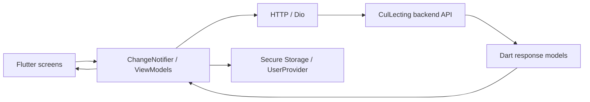

# CulLecting Android

**문화행사를 찾고 상세 정보를 확인하는 Flutter 앱 클라이언트**

날짜·카테고리·검색어로 문화행사를 탐색하고, 로그인과 사용자 프로필을 연결하는 팀 프로젝트입니다. 이 저장소는 Flutter/Dart 클라이언트이며 백엔드와 iOS 저장소는 조직에서 별도로 관리합니다.

## 구현한 사용자 흐름

| 흐름 | 구현 내용 | 코드 |
|---|---|---|
| 로그인·온보딩 | 로그인 요청, 토큰 저장, 사용자 정보 조회, 화면 전환 | [LoginViewModel](lib/viewmodels/logins_viewmodel/login_view_model.dart) |
| 행사 탐색 | 최근 행사, 카테고리, 날짜별 조회와 화면 상태 갱신 | [HomeViewModel](lib/viewmodels/home_view_model.dart) |
| 검색·상세 | 검색어를 query parameter로 전달하고 상세 API와 연결 | [SearchViewModel](lib/viewmodels/search_view_model.dart), [EventContentViewModel](lib/viewmodels/event_content_viewmodel.dart) |
| 프로필 | 사용자 정보 조회·편집과 계정 관련 화면 | [UserProvider](lib/providers/user_provider.dart), [화면](lib/screens/mypage) |

## My contribution

hardlyPw 계정으로 로그인 데모와 문화행사·사용자 기능을 구현했습니다. 아래는 저장소에 남아 있는 기여 이력입니다.

- [로그인 화면 데모](https://github.com/CulLecting/CulLecting-Android/commit/9f3f493)
- [행사·계정 기능과 화면 연결](https://github.com/CulLecting/CulLecting-Android/commit/b4ad219)

기록·카드 편집 관련 화면도 포함되지만 마지막 커밋에는 아카이빙 제외라고 명시돼 있습니다. 전체 아카이빙 완료나 출시 성과로 표현하지 않습니다. 디자인·백엔드·iOS 기여와 팀 규모는 별도로 구분해야 합니다.

## Architecture



화면과 상태를 ViewModel로 나누고 `notifyListeners()`로 결과를 전달합니다. 다만 HTTP 요청이 repository와 ViewModel 양쪽에 존재하고, 일부 ViewModel이 화면 전환도 처리합니다. 일관된 계층 분리와 오류 상태 표현은 개선할 부분입니다.

## 구현에서 다룬 점

- **검색 조건과 API 연결:** 날짜를 `yyyy-MM-dd`로 정규화하고 검색어는 `Uri.https`의 query parameter로 전달합니다.
- **한국어 응답 처리:** JSON 응답의 바이트를 UTF-8로 디코딩한 뒤 모델로 변환합니다.
- **사용자 상태 연결:** 로그인 결과를 저장소와 사용자 Provider로 전달해 후속 화면에서 참조합니다.

## 실행 전 확인

`pubspec.yaml`의 Dart SDK 조건은 `^3.7.2`입니다. Flutter SDK와 Android 실행 환경이 필요합니다.

```sh
flutter pub get
flutter analyze
flutter run
```

현재 코드가 `package:http/http.dart`를 import하지만 `http`는 직접 의존성에 선언되지 않았고, 여러 실행용 패키지가 `dev_dependencies`에 있습니다. 의존성 정리와 백엔드 설정 확인이 필요하며, 위 명령으로 현재 상태의 실행 성공을 검증하지는 않았습니다.

## 검증 상태와 남은 작업

- 2026-09-15에 소스와 커밋을 검토했습니다. 이번 문서 변경에서 앱 빌드·실기기 실행은 수행하지 않았습니다.
- `test/widget_test.dart`는 기본 counter 테스트입니다. 로그인·행사 탐색을 검증한 테스트로 제시하지 않습니다.
- 인증 응답을 출력하는 디버그 로그가 있어 배포 전에 정리가 필요합니다. 토큰 값이나 원본 사용자 데이터는 문서에 포함하지 않습니다.
- 아카이빙 완료, 스토어 출시, 실제 사용자 수, 현재 API 가용성은 확인되지 않았습니다.

## Related work

[CulLecting organization](https://github.com/CulLecting) · [Backend](https://github.com/CulLecting/CulLecting-BE) · [iOS](https://github.com/CulLecting/CulLecting-iOS)
